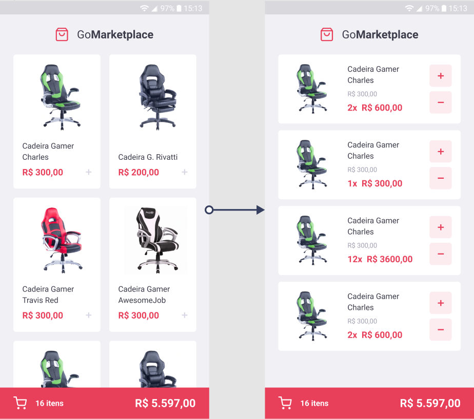
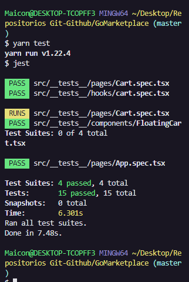

# GoMarketplace

**Desafio 08 - Bootcamp GoStack**

<p align='center'>

</p>

Navegue até a pasta criada e abra no Visual Studio Code, lembre-se de executar o comando ```yarn``` no seu terminal para instalar todas as dependências.

Para startar a aplicação (aplicação em React-Native):
    
    yarn start
    ------------
    yarn android
    ou
    yarn ios

---------------------------------------------------

### Utilizando uma fake API
Antes de tudo, para que você tenha os dados para exibir em tela, criamos um arquivo que você poderá utilizar como fake API para te prover esses dados.

No package.json há uma dependência chamada json-server, e um arquivo chamado server.json que contém os dados para uma rota /products. Para executar esse servidor você pode executar o seguinte comando:

      yarn json-server server.json -p 3333
  
### Layout da aplicação  
Essa aplicação possui um layout que você pode seguir para conseguir visualizar o seu funcionamento.

---------------------------------------------------

### Funcionalidades da aplicação  

**Listar os produtos da fake API:**  
Sua página Dashboard deve ser capaz de exibir uma listagem através de uma tabela, com os campos title, image_url e price.

- **Adicionar itens ao carrinho**    

- **Exibir itens do carrinho**

- **Aumentar quantidade de itens do carrinho**  

- **Diminuir quantidade de um item do carrinho**  

- **Exibir valor total dos itens no carrinho**  

---------------------------------------------------

### Específicação dos testes

Em cada teste, tem uma breve descrição no que sua aplicação deve cumprir para que o teste passe.


- **```should be able to list the products:```** Para que esse teste passe, sua aplicação deve permitir que sejam listados na sua tela Dashboard, toda os produtos que são retornadas do Fake API. Essa listagem deve exibir o title e o price que deve ser formatado utilizando a função Intl.

- **```should be able to add a product to the cart:```** Para que esse teste passe, você deve permitir que seja possível adicionar produtos da sua Dashboard ao carrinho, utilizando o contexto de cart disponibilizado.

- **```should be able to list the products on the cart:```** Para que esse teste passe, você deve permitir que seja possível listar os produtos que estão salvos no contexto do seu carrinho na página Cart, nessa página exiba o nome do produto e o subtotal total de cada produto (price * quantity).

- **```should be able to calculate the cart total:```** Para que esse teste passe, tanto na página Dashboard, tanto na página Cart você deve exibir o valor total de todos os itens que estão no seu carrinho.

- **```should be able to show the total quantity of itens in the cart:```** Para que esse teste passe, tanto na página Dashboard, tanto na página Cart você deve exibir o número total de itens que estão no seu carrinho.

- **```should be able to increment product quantity on the cart:```** Para que esse teste passe, você deve permitir que seja possível incrementar a quantidade de um produto do seu carrinho, utilizando o contexto de cart disponibilizado.

- **```should be able to decrement product quantity on the cart:```** Para que esse teste passe, você deve permitir que seja possível decrementar a quantidade de um produto do seu carrinho, utilizando o contexto de cart disponibilizado.

- **```should be able to navigate to the cart:```** Para que esse teste passe, no seu componente FloatingCart na Dashboard, você deve permitir que ao clicar no botão de carrinho com o testID de navigate-to-cart-button, o usuário seja redirecionado para a página Cart.

- **```should be able to add products to the cart:```** Para que esse teste passe, no seu arquivo onde contém o contexto do carrinho, você deve permitir que a função addToCart adicione um novo item ao carrinho.

- **```should be able to increment quantity:```** Para que esse teste passe, no seu arquivo onde contém o contexto do carrinho, você deve permitir que a função increment incremente em 1 unidade a quantidade de um item que está armazenado no contexto.

- **```should be able to decrement quantity:```** Para que esse teste passe, no seu arquivo onde contém o contexto do carrinho, você deve permitir que a função decrement decremente em 1 unidade a quantidade de um item que está armazenado no contexto.

- **```should store products in AsyncStorage while adding, incrementing and decrementing:```** Para que esse teste passe, no seu arquivo onde contém o contexto do carrinho você deve permitir que todas as atualizações que você fizer no carrinho, sejam salvas no AsyncStorage. Por exemplo, ao adicionar um item ao carrinho, adicione-o também no AsyncStorage. Lembre de também atualizar o valor do AsyncStorage quando você incrementar ou decrementar a quantidade de um item.

- **```should load products from AsyncStorage:```** Para que esse teste passe, no seu arquivo onde contém o contexto do carrinho, você deve permitir que todos os produtos que foram adicionados sejam buscados do AsyncStorage.

<p align='center'>

</p>
